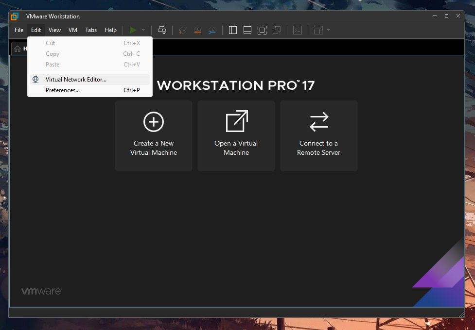
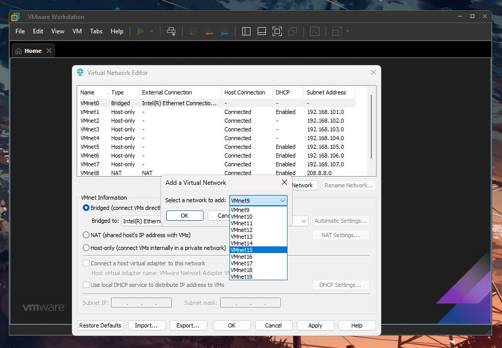
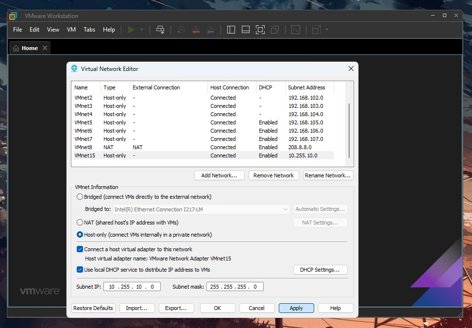
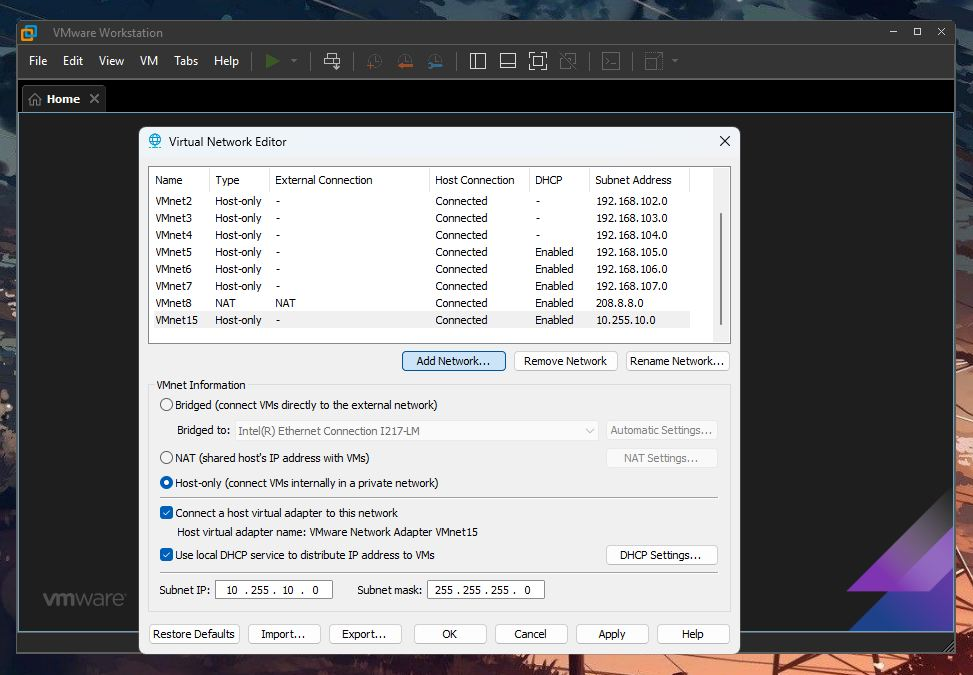
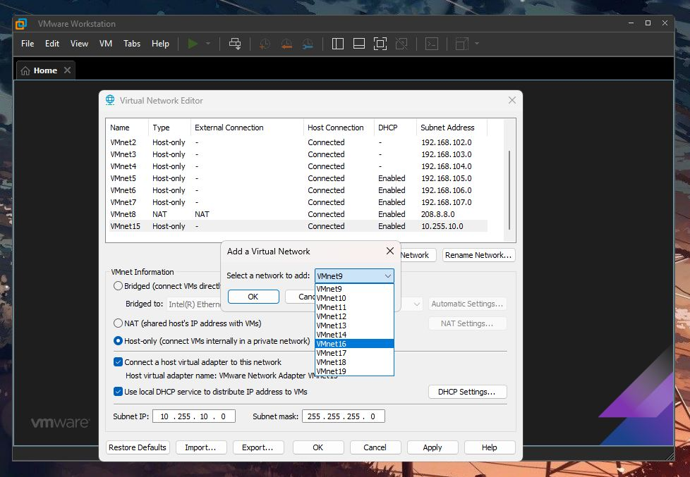
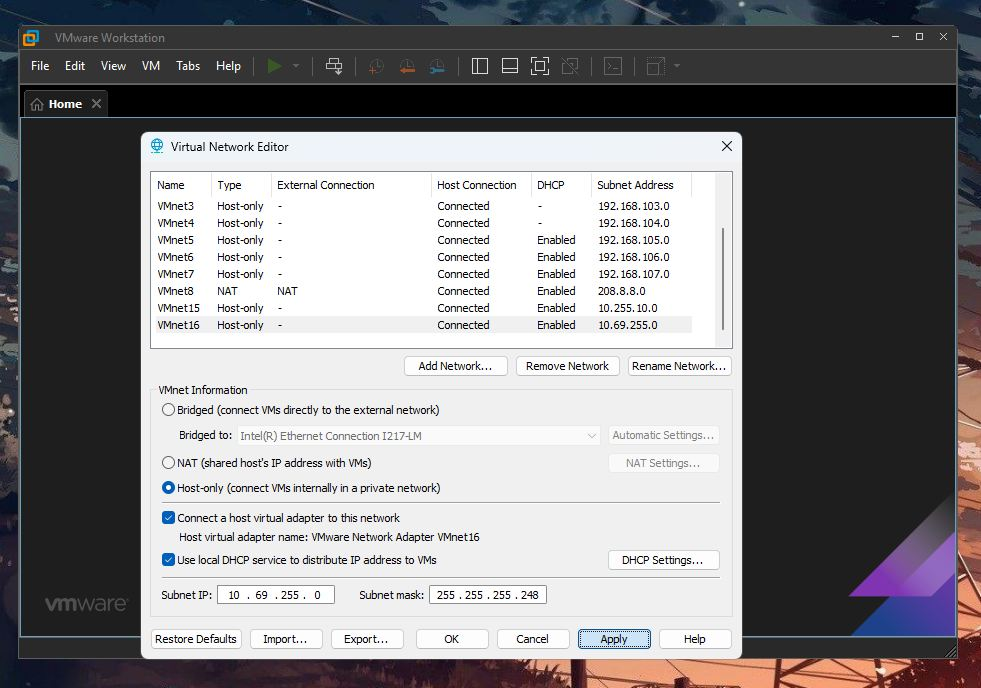

# Access RSTHayup Labs

### Prerequisites
- Terminal Emulator (Putty or __SecureCRT__)
- Type 2 Hypervisor (VMWare __Workstation__)
- __RSTHayup VM__
- Downloaded Repository __Rivan_Day3__

 
 

---
&nbsp;

## Setup the Virtual Workspace
### Create and Configure VMNets 15 & 16

### 1. On VMWare Workstation, go to `Edit` > `Virtual Network Editor..`

 

&nbsp;
---
&nbsp;

### 2. Select `Add Network..`

 

&nbsp;
---
&nbsp;

### 3. Add `VMnet15`

&nbsp;
---
&nbsp;

### 4. Edit VMnet15 with the following settings:
- VMnet Information: __Host-only__
> - [x] Connect a host virtual adapter to this network
> - [x] Use local __DHCP service__ to distribute IP address to VMs
- Subnet IP: 10.255.10.0
- Subnet Mask: 255.255.255.0

&nbsp;
---
&nbsp;

### 5. Now `Add Network..` again

&nbsp;
---
&nbsp;

### 6. Add `VMnet16`

&nbsp;
---
&nbsp;

### 7. Edit VMnet16 with the following settings:
- VMnet Information: __Host-only__
> - [x] Connect a host virtual adapter to this network
> - [x] Use local __DHCP service__ to distribute IP address to VMs
- Subnet IP: 10.69.255.0
- Subnet Mask: 255.255.255.248

&nbsp;
---
&nbsp;

1. 
- VMWare > Virtual Network Adapter
- Add Network
- Select VMNet15
- Modify VMNet15 with the following:
- Add another Network
- Select VMNet16
- Modify VMNet16 with the following:
- Apply and Finish.

2. Download and extract the _RSTHayupV4.7z file.

3. Inside the _RSTHayupV4 directory, open the .vmx file.

4. Power on the Virtual Machine
> ![Note] If you do not create VMNets 15 & 16, _RSTHayupV4 VM will take a while in obtaining IP address for its ethernet interfaces.

5. Select 'I copied it!'

6. Login:
- Username: root
- Password: C1sc0123

7. Delete the Firewall

Enter the following command:
rm -rf /etc/udev/rules.d/70-persistent-net.rules

Then, reboot.

> ![Tip] Press [TAB] to autocomplete. Example: rm -rf /e[TAB]/u[TAB]/r[TAB]/7[TAB]

8. Access the GUI
After the VM has rebooted, it will recieve an IP address.

Open the IP address on a browser
- Select 00 RSTvX: RouteSwitchTshoot Hayup Lab

